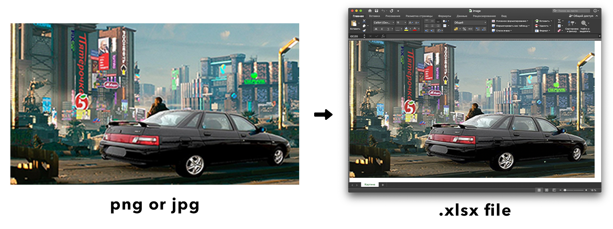

# Переводит фотографии в Excel файл ¯\\\_(ツ)\_/¯

Зависимости:
```python
from openpyxl import Workbook
from openpyxl.styles import Color, PatternFill
from openpyxl.utils import get_column_letter
from PIL import Image
```

Не стоит использовать картинки размером больше 380 px. Excel зависает



# Translates photos to Excel file ¯\\\_(ツ)\_/¯

Dependences:
```python
from openpyxl import Workbook
from openpyxl.styles import Color, PatternFill
from openpyxl.utils import get_column_letter
from PIL import Image
```

Do not use pictures larger than 380 px. Excel hangs
